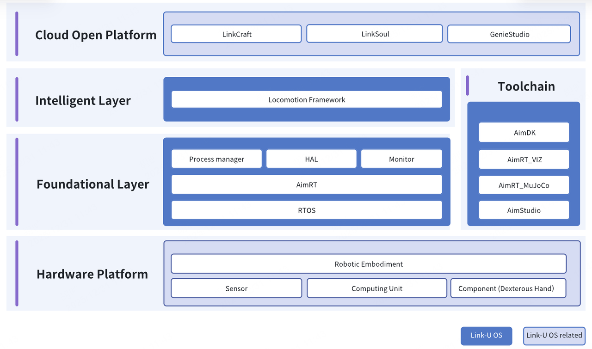

# Link-U-OS

English | [中文](README.zh_CN.md)

## Introduction

Link-U OS is an open-source embodied intelligent operating system designed to meet the full-scenario requirements of embodied intelligent robots. It aims to establish an ecosystem architecture that "adapts to embodied hardware on the southbound and supports intelligent applications on the northbound." At the underlying layer, it provides foundational service frameworks such as stable and efficient distributed swarm real-time communication and hardware abstraction. At the upper layer, it opens up an agent service framework that supports the standardized integration of intelligent foundation models for interaction, manipulation, and locomotion, thereby lowering the barrier to application development. Furthermore, it offers a comprehensive toolchain covering development and debugging, simulation and verification, deployment management, and data recording etc. This empowers developers to rapidly establish a technical closed loop from virtual simulation to physical deployment.

---

## Link-U OS Alpha Release

**Core Features**: Based on production-proven full-size A2 robot, featuring open-source cross-platform embodied software framework, reinforcement learning-based bipedal locomotion control framework, and an all-in-one toolchain for bipedal locomotion simulation, training, and deployment.

### Cross-Platform Embodied Software Framework

#### 🚀 Unified Communication Middleware
Built on our in-house middleware AimRT, supporting both Protobuf and ROS2 Message formats, providing multiple communication modes including RPC and Topic for standardized and efficient inter-module interfaces, while maintaining compatibility with native ROS2 ecosystem.

#### 🛠️ Efficient Build and Integration
Based on Bazel build system, easily managing multi-repository dependencies and third-party libraries, supporting one-click cross-compilation for heterogeneous platforms from x86_64 to aarch64.

#### 🚢 End-to-End Development and Deployment
Provides standardized Docker development environment with automated build and packaging capabilities, complemented by the graphical deployment tool AimStudio, enabling an integrated workflow from development to deployment.

### RL-Based Bipedal Locomotion Simulation, Training, and Deployment Framework

#### 🧠 All-in-One Toolchain
Built on MuJoCo / Isaac Gym, providing a complete toolchain covering training, simulation verification, and real robot deployment.

#### 🚀 Efficient and Stable Training
Centered around PPO algorithm, achieving stable convergence and reusable locomotion policy training for humanoid robot standing and walking.

#### 🌐 Sim2Sim / Sim2Real Support
Single policy codebase seamlessly runs across MuJoCo simulation and real robots.

#### 🛠️ Engineering-Oriented Control Abstraction
Starting from real mechanical structures, abstracting complex mechanisms and drive constraints into control interfaces directly usable by reinforcement learning.

---

## System Architecture

### Multi-Level User Support
- **Hardware Developers**: Supports developers with A2 robots for hands-on development and verification
- **Simulation Learners**: Supports learners without A2 robots to learn and experiment through simulation environments
- **Ecosystem Partners**: Supports ecosystem partners for hardware adaptation based on the OS ecosystem

## Documentation

📖 [Quick Start Guide](document/en/index.md)