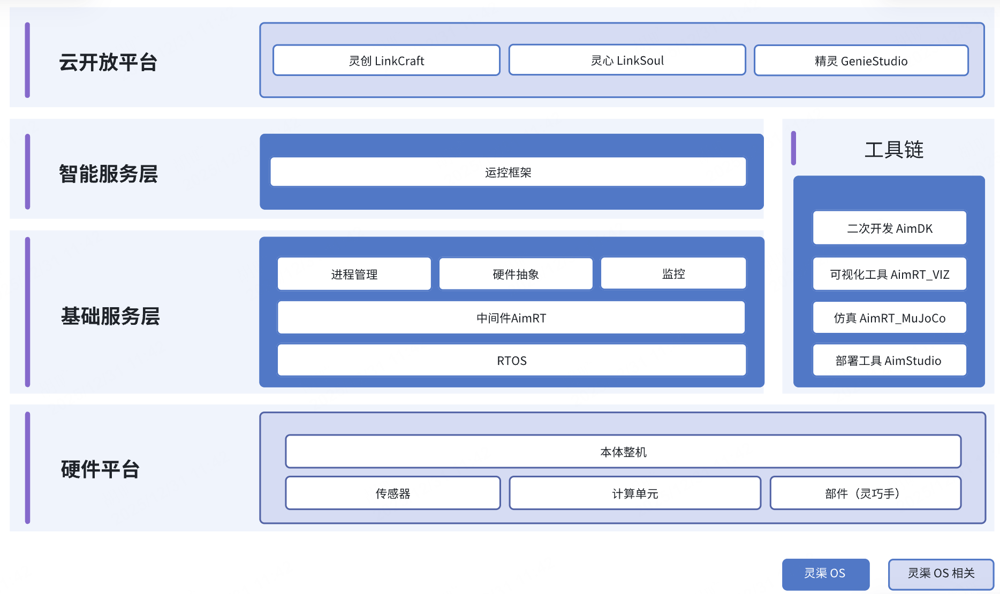

# Link-U-OS

[English](README.md) | 中文

## 简介

灵渠 OS 立足具身智能机器人的全场景需求，构建了 “南向适配具身硬件、北向支撑智能应用” 的生态架构。底层提供稳定、高效的分布式群体实时通信、硬件抽象等基础服务框架；上层开放智能体服务框架，支持交互、作业、运动等智能基座模型的标准化对接，降低应用门槛；同时，提供丰富的工具链，涵盖开发调试、仿真验证、部署管理、数据录制等能力，助力开发者快速构建从虚拟仿真到实体部署的技术闭环。

---

## 灵渠 OS Alpha 

**核心特性**: 基于量产实践的全尺寸智元远征A2本体，开源跨平台具身软件框架、基于强化学习的双足运控框架与双足运控仿真训练部署一站式工具链。

### 跨平台具身软件框架

#### 🚀 统一通信中间件
基于自研中间件 AimRT,支持 Protobuf 与 ROS2 Message 格式,提供 RPC、Topic 等多种通信模式,为模块间交互提供标准、高效的接口,并兼容原生 ROS2 生态。

#### 🛠️ 高效构建与集成
基于 Bazel 构建系统,轻松管理多仓库依赖与第三方库,支持 x86_64 到 aarch64 等异构平台的一键式交叉编译。

#### 🚢 端到端开发部署
提供 Docker 标准化开发环境和自动化构建打包能力,配套图形化部署工具 AimStudio,实现从开发到部署的一体化流程。

### 基于RL的双足运控仿真、训练与部署一站式框架

#### 🧠 一站式工具链
基于 MuJoCo / Isaac Gym 构建覆盖训练、仿真验证与真实机器人部署的完整工具链。

#### 🚀 高效稳定训练
围绕 PPO 算法,实现稳定收敛、可复用的人形机器人站立与行走等运控策略训练。

#### 🌐 Sim2Sim / Sim2Real 支持
同一套策略代码可在 MuJoCo 与真实机器人之间无缝切换运行。

#### 🛠️ 工程化控制抽象
从真实机械结构出发,将复杂机构与驱动约束抽象为强化学习可直接使用的控制接口。

---

## 系统架构

### 多层次用户支持
- **实机开发者**: 支持拥有 A2 机器人的开发者进行实机开发与验证
- **仿真学习者**: 支持无 A2 机器人的学习者通过仿真环境进行学习和实验
- **生态伙伴**: 支持生态伙伴基于 OS 生态进行硬件适配

## 文档

📖 [快速开始指南](document/cn/index.md)