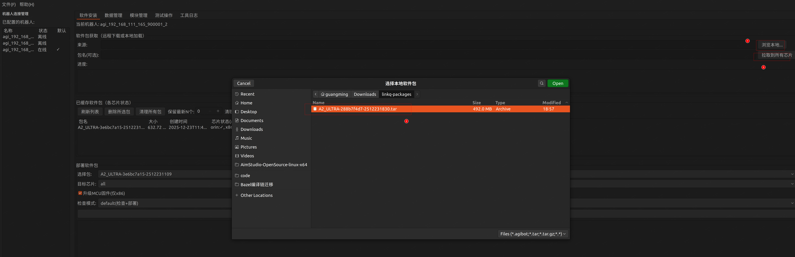
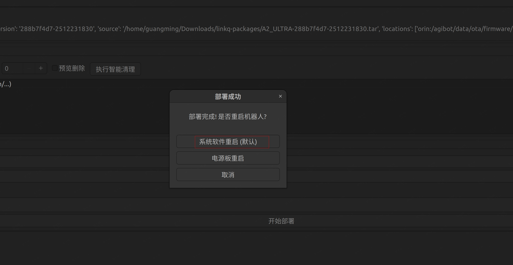

# 产品包部署指南

本指南介绍如何将构建好的产品包部署到智元远征A2旗舰版机器人。

---

## 一、部署前准备

### 1.1 硬件要求

- 智元远征A2旗舰版机器人(天准工控机版)
- 稳定的网络连接

### 1.2 软件要求

**必备条件:**
- 已按照[产品包构建指南](./build_package.md)完成产品包构建
- 机器人系统版本:Ubuntu 22.04 (Jammy)

**ROS2 依赖包(mc 模块必需):**
```bash
ros-humble-xacro
ros-humble-gazebo-ros-pkgs
ros-humble-controller-manager
ros-humble-gazebo-ros2-control
ros-humble-joint-state-publisher
ros-humble-joint-state-broadcaster
ros-humble-joy-teleop
```

### 1.3 依赖包安装

如果机器人尚未安装上述 ROS2 依赖包,请按以下步骤操作:

**步骤 1:添加 ROS2 软件源**
```bash
sudo curl -sSL https://raw.githubusercontent.com/ros/rosdistro/master/ros.key \
  -o /usr/share/keyrings/ros-archive-keyring.gpg && \
echo "deb [arch=$(dpkg --print-architecture) signed-by=/usr/share/keyrings/ros-archive-keyring.gpg] \
  https://mirrors.tuna.tsinghua.edu.cn/ros2/ubuntu jammy main" | \
  sudo tee /etc/apt/sources.list.d/ros2.list > /dev/null && \
sudo apt-get update -y
```

**常见问题处理:**

如遇到 GPG 密钥验证错误:
```
GPG error: http://packages.ros.org/ros2/ubuntu jammy InRelease: 
The following signatures couldn't be verified because the public key is not available: 
NO_PUBKEY F42ED6FBAB17C654
```

执行以下命令修复:
```bash
# 删除旧密钥
sudo apt-key del F42ED6FBAB17C654

# 添加更新的密钥
sudo curl -sSL https://raw.githubusercontent.com/ros/rosdistro/master/ros.key \
  -o /usr/share/keyrings/ros-archive-keyring.gpg

# 更新软件源配置
echo "deb [arch=$(dpkg --print-architecture) signed-by=/usr/share/keyrings/ros-archive-keyring.gpg] \
  http://packages.ros.org/ros2/ubuntu $(. /etc/os-release && echo $UBUNTU_CODENAME) main" | \
  sudo tee /etc/apt/sources.list.d/ros2.list > /dev/null

# 更新包列表
sudo apt update
```

**步骤 2:安装依赖包**
```bash
sudo apt-get install -y \
  ros-humble-xacro \
  ros-humble-gazebo-ros-pkgs \
  ros-humble-controller-manager \
  ros-humble-gazebo-ros2-control \
  ros-humble-joint-state-publisher \
  ros-humble-joint-state-broadcaster \
  ros-humble-joy-teleop
```

---

## 二、部署工具:AimStudio

### 2.1 工具简介

**AimStudio** 是一款跨平台的可视化部署工具,支持通过图形界面完成机器人软件的部署和管理。

- **官方文档**: https://github.com/Link-U-OS/AimStudio/tree/main/docs
- **支持平台**:Linux / Windows / macOS

### 2.2 下载与安装

访问以下链接下载适合您操作系统的版本:

https://github.com/Link-U-OS/AimStudio/releases


根据提示完成安装后启动 AimStudio。

---

## 三、部署步骤

### 3.1 连接机器人


1. 点击界面左下角的"连接新机器人"按钮
2. 在弹出对话框中输入机器人的连接信息:
   - IP 地址
   - 端口号
   - 认证信息(如需要)
3. 点击"连接"完成连接

提示:首次连接可能需要几秒钟,请耐心等待。

### 3.2 拉取产品包


1. 点击“软件安装”页签中“浏览本地”按钮选择本地软件包
2. 然后点击“拉取到所有芯片”

### 3.3 部署产品包


1. 拉取软件包成功后在部署软件包中选择对应包
2. 点击"开始部署"启动部署流程
3. 等待部署进度条完成(通常需要 2-5 分钟)

注意:部署过程中请勿断开网络连接或关闭 AimStudio。

### 3.4 重启机器人



1. 部署成功后,在弹出的提示对话框中点击"系统软件重启"
2. 等待约 10-15 秒,让系统完成重启流程
3. 在 AimStudio 中点击"重新连接"恢复与机器人的连接

### 3.5 验证部署结果


1. 切换到"模块管理"页签
2. 点击"刷新状态"按钮更新应用列表
3. 在"运行中的应用"区域确认新部署的应用已成功启动
4. 检查应用状态是否为"运行中"

---

## 四、故障排查

### 4.1 无法连接机器人

**可能原因及解决方案:**

- **网络问题**:确认机器人和电脑在同一网络,尝试 ping 机器人 IP 地址
- **IP/端口错误**:核对机器人的实际 IP 地址和端口配置
- **机器人未开机**:确认机器人电源已打开且系统已完全启动

### 4.2 依赖包安装失败

**可能原因及解决方案:**

- **网络连接问题**:测试是否能访问 `mirrors.tuna.tsinghua.edu.cn`,必要时更换镜像源
- **系统版本不匹配**:运行 `lsb_release -a` 确认系统为 Ubuntu 22.04
- **软件源配置错误**:重新执行步骤 1.3 中的软件源配置命令
- **磁盘空间不足**:运行 `df -h` 检查可用磁盘空间

