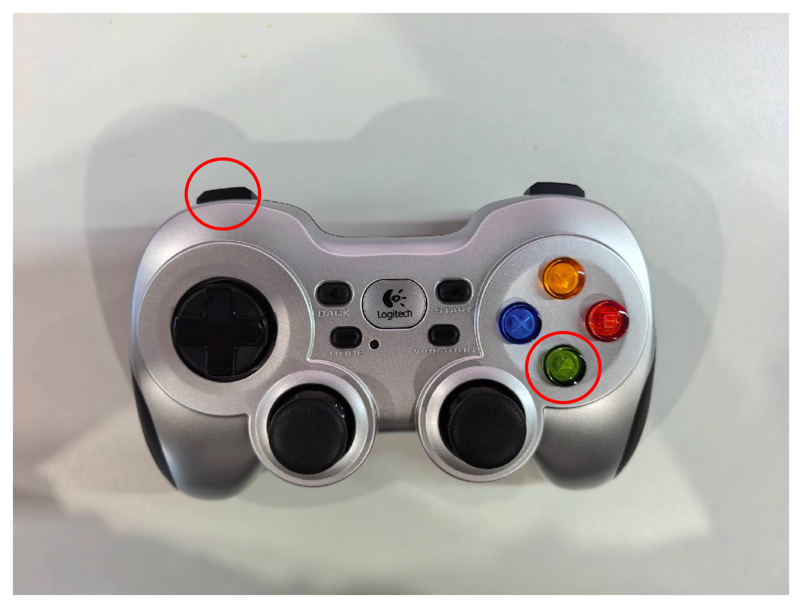

# 机器人操作指南

请详细阅读以下内容，确保理解手柄操作流程和逻辑后再上实机运行。手柄同样可用于仿真环境，建议在仿真环境熟悉手柄操作逻辑后再上实机运行。

## 手柄操作流程

操作前，请确保机器人急停手柄电量充足且可以随时被按下

1. 按下手柄“start”键机器人进入启动模式
	- 机上的容器内终端，应显示“start control”字样
  

2. 同时按下手柄“LB”和“A”键机器人进入位控模式
	- 机上的容器内终端，应显示“lie2stand”字样
  

此时放下机器人，确保机器人双脚落地，搀扶机器人使其保持平衡，确保吊绳松弛

3. 按下手柄“X”键机器人进入运控模式
	- 机上的容器内终端，应显示“stand2walk”字样

此时确保机器人急停手柄电量充足且可以随时被按下，并确认机器人周边环境安全

4. 按下手柄“LB”键使能控制摇杆，两个摇杆可发出控制指令
	- 红色箭头对应摇杆方向控制前进后退
	- 绿色箭头对应摇杆方向控制左右横移
	- 蓝色箭头对应摇杆方向控制左右转向

5. 按下手柄“Y”键(绿色圈出)，吊起机器人后按下手柄“start”键(蓝色圈出)，结束机器人控制

## 手柄按键逻辑
1. “start”键：切换机器人进入或退出启动模式
	- 启动模式：各关节位控，此时Kp很小，机器人应显性的表现为腿部臂部关节受很小的力，可以被扳动但会感受到阻力；机上的容器内终端，应显示“start control”字样
	- 退出启动模式：此时机器人腿部臂部关节不受力，终端显示“stop control”字样
2. "LB"和“A”键：切换机器人进入或退出位控模式
	- 进入运控模式：机器人应显性的表现为腿部臂部关节受力，可以被小幅度扳动但会感受到阻力；机上的容器内终端，应显示“lie2stand”字样
	- 退出运控模式：机器人回到启动模式，终端显示“stand2lie”字样
3. “X”键：切换机器人进入运控模式
	- 机器人可以自主站立；机上的容器内终端，应显示“stand2walk”字样
4. “Y”键：切换机器人退出运控模式
	- 机器人回到位控模式，终端显示“walk2stand”字样
5. “LB”键：使能控制摇杆
	- 该按键被按下时，手柄的两个摇杆才可以发出控制指令