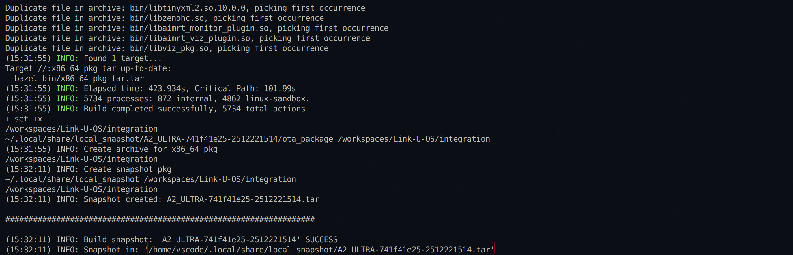

# Product Package Build Guide

## Prerequisites

### Pull integration Repository

If you have already completed the operation through [Clone Link-U-OS Code Repository](./setup_environment.md#clone-Link-U-OS-code-repository), the integration repository should already exist in the sibling directory and you can skip this step.

Otherwise, execute the following commands:
```bash
cd ..
git clone git@github.com:Link-U-OS/integration.git
```

## Compile Product Package

### Basic Usage
```bash
cd integration
bash tools/build_package.sh [parameters]
```

### Parameter Description

| Parameter | Description | Default Value | Example |
|-----------|-------------|---------------|---------|
| `-p` | Specify compilation platform type | `A2_ULTRA` | `-p A2_ULTRA` |
| `-j` | Specify number of compilation threads | `0` (automatic) | `-j 8` |
| `-g` | Compile debug version | Off | `-g` |
| `-o` | Compile specified repository using local source code | None | `-o aimrt_comm=../aimrt_comm` |
| `-c` | Clear compilation cache | Off | `-c` |
| `-e` | Pass additional compilation options | None | `-e "--config=commit"` |

### Compilation Modes

**Branch Mode (Default)**
- Uses branch source code specified in `projects/defs/source_branch.yaml`
- To automatically pull the latest code each time, first execute `bazel clean --expunge`

**Node Mode**
- Add parameter: `-e "--config=commit"`
- Uses commit node source code specified in `projects/defs/source_commit.yaml`

### Usage Examples
```bash
# Basic compilation
bash tools/build_package.sh

# Compile debug version with 8 threads
bash tools/build_package.sh -j 8 -g

# Compile after clearing cache, using local aimrt_comm source code
bash tools/build_package.sh -c -o aimrt_comm=../aimrt_comm

# Compile using specified commit node
bash tools/build_package.sh -e "--config=commit"
```

## Compilation Results

### Output Location

After compilation is complete, the product package is generated in the `/home/vscode/.local/share/local_snapshot/` directory, and the terminal will print the specific path:



### Export to Host

For convenient deployment on the host, you can copy the product package to the mounted directory:
```bash
cp /home/vscode/.local/share/local_snapshot/A2_ULTRA-741f41e25-2512221514.tar /workspaces/Link-U-OS/
```

> **Tip**: Please replace the package name in the above command according to the actual generated file name.
