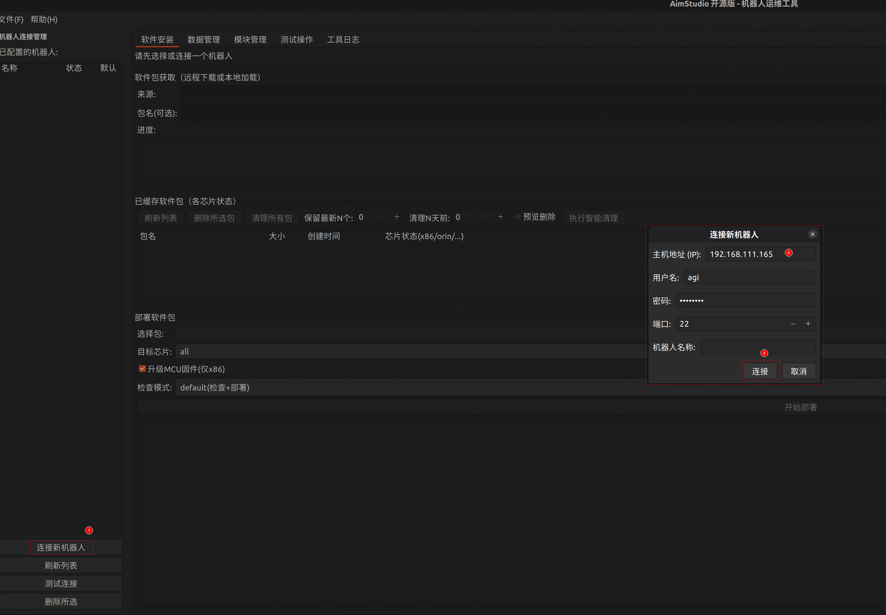
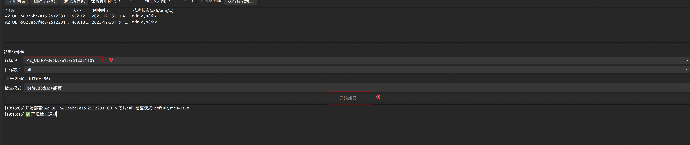
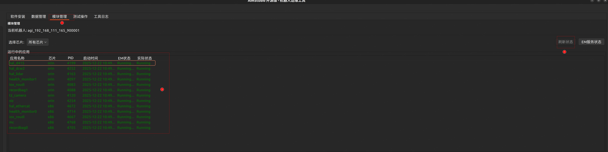

# Product Package Deployment Guide

This guide explains how to deploy built product packages to the Agibot Expedition A2 Flagship Edition robot.

---

## 1. Pre-Deployment Preparation

### 1.1 Hardware Requirements

- Agibot Expedition A2 Flagship Edition robot (Tianzun industrial computer version)
- Stable network connection

### 1.2 Software Requirements

**Prerequisites:**
- Product package built according to the [Product Package Build Guide](./build_package.md)
- Robot system version: Ubuntu 22.04 (Jammy)

**ROS2 Dependencies (required for mc module):**
```bash
ros-humble-xacro
ros-humble-gazebo-ros-pkgs
ros-humble-controller-manager
ros-humble-gazebo-ros2-control
ros-humble-joint-state-publisher
ros-humble-joint-state-broadcaster
ros-humble-joy-teleop
```

### 1.3 Dependency Installation

If the robot does not have the above ROS2 dependencies installed, follow these steps:

**Step 1: Add ROS2 Repository**
```bash
sudo curl -sSL https://raw.githubusercontent.com/ros/rosdistro/master/ros.key \
  -o /usr/share/keyrings/ros-archive-keyring.gpg && \
echo "deb [arch=$(dpkg --print-architecture) signed-by=/usr/share/keyrings/ros-archive-keyring.gpg] \
  https://mirrors.tuna.tsinghua.edu.cn/ros2/ubuntu jammy main" | \
  sudo tee /etc/apt/sources.list.d/ros2.list > /dev/null && \
sudo apt-get update -y
```

**Common Issue Resolution:**

If you encounter a GPG key verification error:
```
GPG error: http://packages.ros.org/ros2/ubuntu jammy InRelease: 
The following signatures couldn't be verified because the public key is not available: 
NO_PUBKEY F42ED6FBAB17C654
```

Execute the following commands to fix:
```bash
# Remove old key
sudo apt-key del F42ED6FBAB17C654

# Add updated key
sudo curl -sSL https://raw.githubusercontent.com/ros/rosdistro/master/ros.key \
  -o /usr/share/keyrings/ros-archive-keyring.gpg

# Update repository configuration
echo "deb [arch=$(dpkg --print-architecture) signed-by=/usr/share/keyrings/ros-archive-keyring.gpg] \
  http://packages.ros.org/ros2/ubuntu $(. /etc/os-release && echo $UBUNTU_CODENAME) main" | \
  sudo tee /etc/apt/sources.list.d/ros2.list > /dev/null

# Update package list
sudo apt update
```

**Step 2: Install Dependencies**
```bash
sudo apt-get install -y \
  ros-humble-xacro \
  ros-humble-gazebo-ros-pkgs \
  ros-humble-controller-manager \
  ros-humble-gazebo-ros2-control \
  ros-humble-joint-state-publisher \
  ros-humble-joint-state-broadcaster \
  ros-humble-joy-teleop
```

---

## 2. Deployment Tool: AimStudio

### 2.1 Tool Introduction

**AimStudio** is a cross-platform visual deployment tool that supports robot software deployment and management through a graphical interface.

- **Official Documentation**: https://github.com/Link-U-OS/AimStudio/tree/main/docs
- **Supported Platforms**: Linux / Windows / macOS

### 2.2 Download and Installation

Visit the following link to download the version suitable for your operating system:

https://github.com/Link-U-OS/AimStudio/releases


Complete the installation according to the prompts and launch AimStudio.

---

## 3. Deployment Steps

### 3.1 Connect to Robot



1. Click the "Connect New Robot" button in the lower left corner of the interface
2. Enter the robot's connection information in the pop-up dialog:
   - IP address
   - Port number
   - Authentication information (if required)
3. Click "Connect" to complete the connection

**Tip:** The first connection may take a few seconds, please be patient.

### 3.2 Pull Product Package


1. Click the "Browse Local" button in the "Software Installation" tab to select a local software package
2. Then click "Pull to All Chips"

### 3.3 Deploy Product Package



1. After successfully pulling the software package, select the corresponding package in the deployment software packages section
2. Click "Start Deployment" to initiate the deployment process
3. Wait for the deployment progress bar to complete (usually takes 2-5 minutes)

**Note:** Do not disconnect the network or close AimStudio during deployment.

### 3.4 Restart Robot


1. After successful deployment, click "System Software Restart" in the pop-up prompt dialog
2. Wait approximately 10-15 seconds for the system to complete the restart process
3. Click "Reconnect" in AimStudio to restore connection with the robot

### 3.5 Verify Deployment Results



1. Switch to the "Module Management" tab
2. Click the "Refresh Status" button to update the application list
3. Confirm that the newly deployed application has successfully started in the "Running Applications" area
4. Check that the application status shows "Running"

---

## 4. Troubleshooting

### 4.1 Cannot Connect to Robot

**Possible Causes and Solutions:**

- **Network Issues**: Confirm that the robot and computer are on the same network, try pinging the robot's IP address
- **Incorrect IP/Port**: Verify the robot's actual IP address and port configuration
- **Robot Not Powered On**: Confirm the robot is powered on and the system has fully started

### 4.2 Dependency Installation Failed

**Possible Causes and Solutions:**

- **Network Connection Issues**: Test whether you can access `mirrors.tuna.tsinghua.edu.cn`, switch mirror sources if necessary
- **System Version Mismatch**: Run `lsb_release -a` to confirm the system is Ubuntu 22.04
- **Repository Configuration Error**: Re-execute the repository configuration commands in step 1.3
- **Insufficient Disk Space**: Run `df -h` to check available disk space